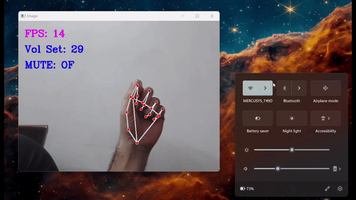

# Computer Vision Volume Controller with Hand ✋🏻

## Computer Vision Volume Controller with OpenCV and Mediapipe

This `Computer Vision Project`, using Mediapipe and OpenCV, uses the Right Hand to Control the Volume of the Computer System with moving the fingers.

The Code of the Project are in the `gestures_with_hand.ipynb` and `HandTrackingModule.py` files.

## Check-it out
- Computer Vision Volume Controller Preview: https://youtu.be/FbPOyAUANTM